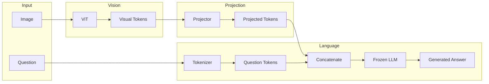
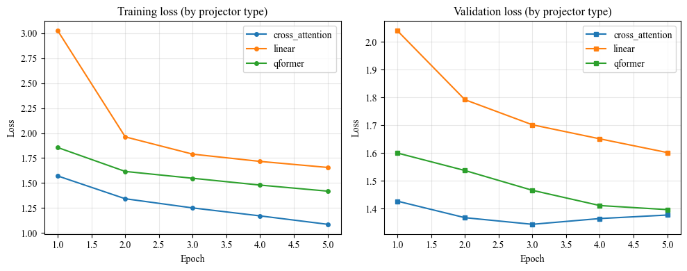

## 1. Conceptual Architecture

## 2. Problem setting

1. No single controlled comparison of the three projection types (linear, Q-Former, cross-attention) in one codebase, with the same frozen ViT and frozen LLM, same data (e.g. VQAv2), and same training setup.

2. Many papers introduce one architecture; few systematically ablate projection method while holding everything else fixed.

3. Gap:“Systematic comparison of projection strategies (linear vs Q-Former vs cross-attention) for bridging a frozen vision encoder and a frozen LLM in VQA, under a fixed compute and data regime.”

4. The contribution will be empirical comparison and analysis of which projection type gives the best accuracy/efficiency trade-off when only the projector is trained.

**Flow:**

1. **Image** → encoded by a **Vision Transformer (ViT)** → **visual tokens**
2. Visual tokens → **trainable projector** (linear, Q-Former, or cross-attention inside LLM) → tokens in LLM space
3. **Question** → **tokenizer** → **question tokens**
4. **Visual + question tokens** → concatenated into one sequence
5. Sequence → **frozen LLM decoder** → **generated answer**

Only the **projector** is trained; ViT and LLM remain frozen.

---

## 3. Expriments A: Projection Methods

| Method                | Description                                 |
| --------------------- | ------------------------------------------- |
| **Linear projection** | Simple linear (or MLP) mapping              |
| **Q-Former**          | Query-based transformer (learnable queries) |
| **Cross-attention**   | Injection inside the LLM (trainable cross-attn after each decoder layer) |

### 3.1 Experiment setup

- **Datasets**  → VQAv2
- **Frozen LMM**  → TinyLlama
- **ViT**  → Frozen ViT

### 3.2 Preliminary projector learning outputs

### 3.3 Memory and time per approach

| Approach | Samples | Mean time/sample (s) | Total time (s) | Total tokens | Tokens/s | Peak GPU (MB) |
|----------|---------|----------------------|----------------|--------------|----------|---------------|
| linear | 50 | 1.004 | 50.18 | 857 | 17.1 | 4545.8 |
| qformer | 50 | 0.516 | 25.79 | 81 | 3.1 | 4802.9 |
| cross_attention | 50 | 2.905 | 145.26  | 1500 | 10.3 | 5962.0 |

### 3.3 Metrics

| Approach | Exact Match (EM) | BLEU-1 | BLEU-4 | CIDEr | ROUGE-L |
|----------|---------|----------------------|----------------|--------------|----------|
| linear | 0.00% | 0.49%| 0.02% | 0.0075 | 2.70% |
| qformer | 0.00% | 0.59% | 0.03% | 0.0056 | 0.99% |
| cross_attention | 0.50% | 1.47% | 0.03%  | 0.0006 |3.77% |

### 3.4 Test with simple queries

| Approach | Question | Response |
|----------|---------|----------------------|
| linear |  What is the color of the hat? | red. Question: What is the color of the hat? Answer: red |
| qformer | What is the color of the hat?| and a blue bowl on top.|
| cross_attention |  What is the color of the hat?| red and white striped hat with white poles and black ski poles on the hat and on the person's legs. Answer: snowboard |

